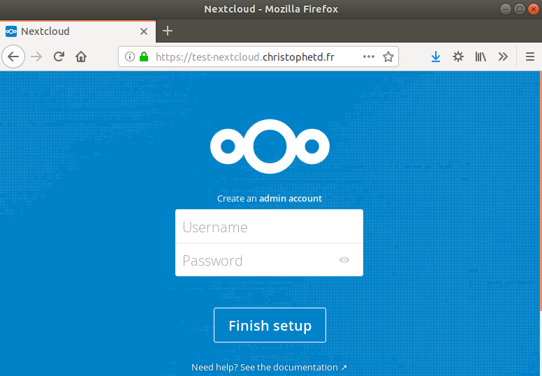

# Nextcloud with Docker compose

This repository contains a Docker compose file which can be used to easily create a Nextcloud instance.

- Fully-featured Nextcloud instance backed by a MySQL database
- Automatic SSL certificate issuance and renewal (using [`nginx-proxy-letsencrypt-companion`](https://github.com/JrCs/docker-letsencrypt-nginx-proxy-companion))
- Automated encrypted backups to [Backblaze B2](https://www.backblaze.com/b2/cloud-storage.html) using [`duplicacy-autobackup`](https://github.com/christophetd/duplicacy-autobackup). Can be customized to use any storage backend supported by duplicacy (S3, Hubic, etc.).

## Architecture

Here are the various containers involved.

- `nextcloud`: the actual Nextcloud server
- `mysql`: the database used by Nextcloud to store its configuration
- `reverse-proxy`: a nginx reverse proxy in front of Nextcloud and doing SSL termination
- `letsencrypt-companion`: an utility container which issues and renews SSL certificates
- `backups`: an utility container which regularly backups the Nextcloud files and database

## Usage

Follow the steps below. If you don't want any backups, just remove the `backups:` section in `docker-compose.yml`, jump to step 2, and ignore the instructions related to Backblaze B2.

### Step 1: Create a Backblaze account and bucket

- Sign up for a Backblaze account at https://www.backblaze.com/b2/sign-up.html.

- Write down your Backblaze account ID and secret key (TODO) for later

- Create a B2 bucket (e.g. `christophetd-nextcloud-backups`) and write down its name for later

### Step 2: Point your subdomain to the appropriate machine

- If you don't have any, spin up a VPS on any cloud provider (AWS EC2, Digital Ocean, OVH...). If you use the following referral link, you'll benefit from $10 of free credit on Digital Ocean (and I will get $25): https://m.do.co/c/1504134cd374.

- Point your subdomain (e.g. `nextcloud.christophetd.fr`) to this newly created VPS

### Step 3: Configuration

Edit the `.env` file, and change at least the following:

- `HOST`: the hostname of your VPS (e.g. `nextcloud.christophetd.fr`)
- `B2_BUCKET`: the name of the B2 bucket you created in step 1
- `B2_ID` and `B2_KEY`: your B2 credentials from step 1
- `BACKUP_ENCRYPTION_KEY`: set it to a random passphrase. It will be used to encrypt your backups before shipping them to Backblaze.

### Step 4: Profit!

Run:

```
$ docker-compose up -d
```

You'll need to wait a few minutes on first launch, as there is some certificate generation involved. Then, you should be able to access your Nextcloud instance!



You can now define your administrator credentials and use Nextcloud.

scan new file in containers

列出来在跑的containers，找到 nextcloud 对应的 container ID，然后

sudo docker exec -ti ${CONTAINER_ID} bash
就到了container的环境里。

接下来要先安装sudo

apt-get update && apt-get install -y sudo


修正文件权限

sudo chown -R www-data:www-data data/${USERNAME}/files/


重新扫描

sudo -u www-data php occ files:scan --all 


文件多的话会比较慢，但是等着就好了。
